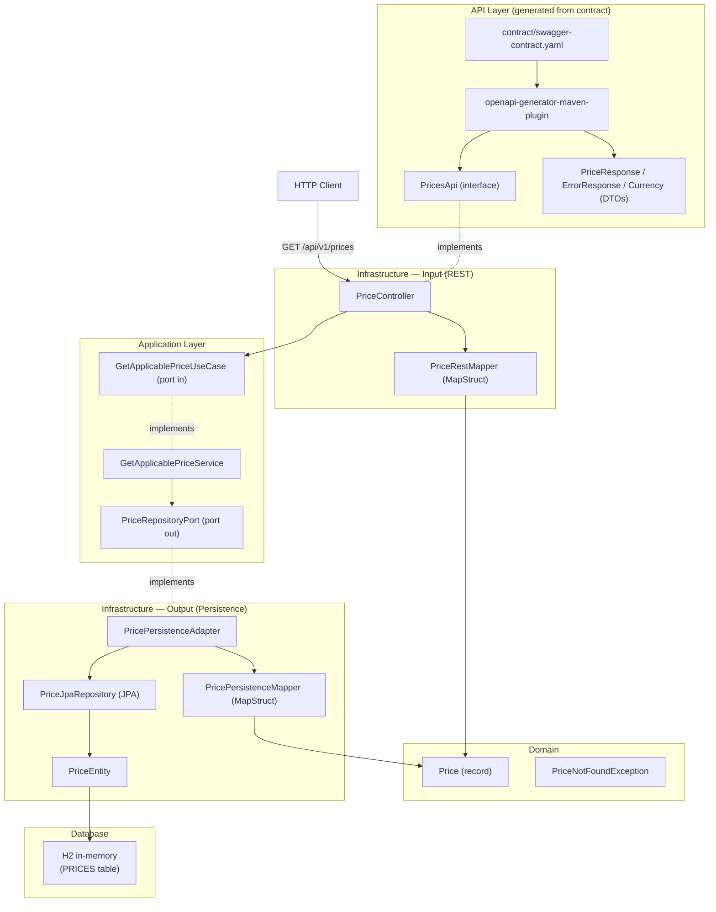

# Price Service

REST service that returns the applicable price for a product in an Inditex brand at a given date and time, resolving by priority when multiple rates overlap.

## Requirements

- Java 21
- Maven (or use the included Maven Wrapper — no installation needed)

## Build & Run

### Using Maven Wrapper (recommended)

```bash
# Linux / macOS
./mvnw spring-boot:run

# Windows
.\mvnw.cmd spring-boot:run
```

### Using local Maven

```bash
mvn spring-boot:run
```

The application starts on **http://localhost:8080**

### Local developer profile

For local development, run with the `local` profile to enable the H2 Console, SQL logging, and DEBUG output:

```bash
# Windows
.\mvnw.cmd spring-boot:run -Dspring-boot.run.profiles=local

# Linux / macOS
./mvnw spring-boot:run -Dspring-boot.run.profiles=local

# Or via environment variable
export SPRING_PROFILES_ACTIVE=local && ./mvnw spring-boot:run   # Linux/macOS
$env:SPRING_PROFILES_ACTIVE="local"; .\mvnw.cmd spring-boot:run # Windows
```

With the `local` profile active:
- **H2 Console** available at http://localhost:8080/h2-console (JDBC URL: `jdbc:h2:mem:pricesdb`)
- SQL queries printed and formatted in the console
- Application logs at `DEBUG` level

> `application-local.yml` is excluded from git. It is created locally and never committed.

---

## API

### Get applicable price

```
GET /api/v1/prices
```

| Parameter         | Type     | Required | Description                              |
|-------------------|----------|----------|------------------------------------------|
| `applicationDate` | datetime | Yes      | ISO 8601 format — `2020-06-14T10:00:00` |
| `productId`       | integer  | Yes      | Product identifier                       |
| `brandId`         | integer  | Yes      | Brand identifier (1 = ZARA)              |

**Example request:**

```bash
curl "http://localhost:8080/api/v1/prices?applicationDate=2020-06-14T10:00:00&productId=35455&brandId=1"
```

**Example response (200):**

```json
{
  "productId": 35455,
  "brandId": 1,
  "priceList": 1,
  "startDate": "2020-06-14T00:00:00",
  "endDate": "2020-12-31T23:59:59",
  "price": 35.50,
  "currency": "EUR"
}
```

**Error responses:**

| Status | Description                        |
|--------|------------------------------------|
| 400    | Missing or invalid parameter       |
| 404    | No applicable price found          |
| 500    | Unexpected server error            |

---

## Docker

### Build the image

```bash
docker build -t price-service .
```

### Run the container

```bash
docker run -d -p 8080:8080 --name price-service price-service
```

The application starts on **http://localhost:8080**

### Stop and remove

```bash
docker stop price-service && docker rm price-service
```

---

## CI

The repository includes a GitHub Actions workflow at `.github/workflows/ci.yml` that runs automatically on every pull request targeting `main`.

**Steps:**
1. Checkout code
2. Set up Java 21 (Temurin) with Maven cache
3. `./mvnw verify` — compiles, runs all 26 tests, and validates the build
4. Uploads Surefire test reports as a build artifact

The workflow must pass before a PR can be merged into `main` (enforced via branch protection rules).

---

## Swagger UI

Available at **http://localhost:8080/swagger-ui.html** once the application is running.

To explore the contract without running the app, open it directly in Swagger Editor:

[Open in Swagger Editor](https://editor.swagger.io/?url=https://raw.githubusercontent.com/Lolo179/inditex-price-service/main/contract/swagger-contract.yaml)

---

## Tests

```bash
# Linux / macOS
./mvnw test

# Windows
.\mvnw.cmd test
```

17 tests across four layers:

| Class                              | Type                            | Tests |
|------------------------------------|---------------------------------|-------|
| `GetApplicablePriceServiceTest`    | Unit (Mockito)                  | 3     |
| `PricePersistenceAdapterTest`      | JPA slice (`@DataJpaTest`)      | 6     |
| `PriceE2ETest`                     | E2E RestAssured (MockMvc)       | 7     |
| `PriceServiceApplicationTests`     | Context load                    | 1     |

---

## Postman collection

Importar desde `src/test/resources/price-service.postman_collection.json`.

Contiene 9 requests con assertions automáticas:
- Los 5 casos requeridos del ejercicio
- 404 producto inexistente
- 404 fecha fuera de rango
- 400 formato de fecha inválido
- 400 parámetro requerido ausente

Requiere la aplicación corriendo en `http://localhost:8080`.

---

## Architecture



---

## Design decisions

### BRAND table and foreign key omitted

The exercise specification mentions that `BRAND_ID` in the `PRICES` table could reference a `BRAND` table. This foreign key has been deliberately omitted for the following reasons:

- The exercise does not require querying brand attributes — `brandId` is used solely as a filter parameter.
- Adding a `BRAND` table and its FK would introduce additional setup (DDL, seed data, JPA entity, cascade config) with no functional benefit for the scope of this service.
- In a real system this relationship would exist and would be owned by a separate bounded context (e.g. a Brand service), making a cross-service FK an anti-pattern in any case.

If the FK were required, it would be declared on `PriceEntity` as:
```java
@ManyToOne(fetch = FetchType.LAZY)
@JoinColumn(name = "brand_id", nullable = false)
private BrandEntity brand;
```

- **Contract-first**: `contract/swagger-contract.yaml` is the source of truth. The API interface and DTOs are generated at compile time via `openapi-generator-maven-plugin`.
- **MapStruct** handles all object mapping between layers.
- **H2 in-memory** database — schema created by Hibernate, seeded by `data.sql`.
-- test change to trigger CI